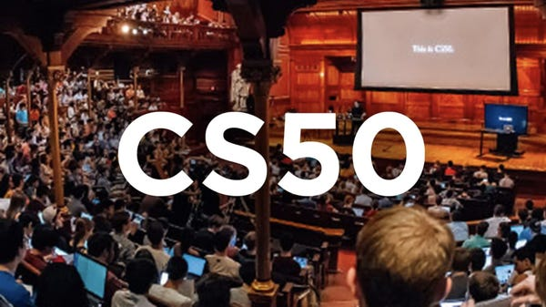

# CS50x2021 - 2022
I made this repository to post my solutions to Harvard University's [**CS50x2021**](https://cs50.harvard.edu/x/2021/)

### Table of contents

### DISCLAIMER

Please don't just copy the code mindlessly without trying to solve the problems yourself, it's totally pointless if you actually wanna learn how to write software and a blatant violation of the [**Academic Honesty**](https://cs50.harvard.edu/x/2021/honesty/)of the course.
